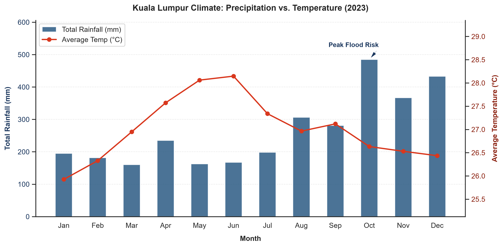

# Kuala Lumpur Climate Analytics: Precipitation vs. Temperature



## Overview
This repository contains a Python-based data visualization project developed to analyze the relationship between precipitation and temperature in Kuala Lumpur. By automating data ingestion from a public weather API, this project demonstrates data engineering, statistical profiling, and advanced visualization techniques.

## What the Data Shows
This visualization of Kuala Lumpur's 2023 meteorological data reveals a clear inverse relationship between seasonal precipitation volume and average ambient temperature. Specifically, it highlights that the intense rainfall spikes during the monsoon transition not only drive significant urban cooling, but also pinpoint the exact seasonal thresholds where metropolitan drainage infrastructure faces its highest flood risk.

## Technologies Used
* **Data Source:** Open-Meteo Historical Weather API
* **Language:** Python
* **Libraries:** `pandas` (Data manipulation), `matplotlib` & `seaborn` (Dual-axis visualization, Statistical formatting), `requests` (API ingestion)
* **Techniques:** Automated REST API ingestion, `.groupby()` temporal aggregation, Pearson correlation profiling, dynamic chart scaling.

---

## How to Run This Project Locally

To replicate this analysis and generate the visualization on your local machine, follow these steps:

### 1. Clone the repository
```bash
git clone [https://github.com/Xuan09-30/Simple-Climate-Analysis.git](https://github.com/Xuan09-30/Simple-Climate-Analysis.git)
cd Simple-Climate-Analysis
